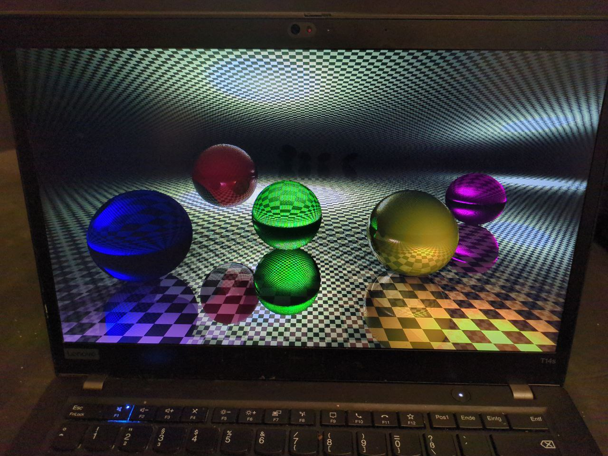

Ever wanted to raytrace but have no Window, GUI, Window Manager, Compositor, nothing? Worry no more! The Linux Direct Rendering Module (DRM) lets you directly access a display frame buffer so you can just throw all your funny linear-algebra-foo on the glass, together with the implicit surfaces, the phong lighting, the diffraction surfaces and all the other classy math stuff that you always wanted to implement in C and send to the kernel.

See also: https://github.com/maj0ran/drm-timetables

